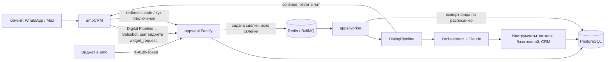

# Архитектура (фазы 0–2)

## Поток входящего сообщения (раздел 5 ТЗ)

| Шаг | Где | Что происходит |
|---|---|---|
| 1 | amo | Входящее сообщение → Digital Pipeline запускает Salesbot → шаг виджета делает `POST /salesbot/v1/hook` с `{token, data: {lead_id, message}, return_url}` |
| 2 | `apps/api/src/routes/salesbot.ts` | Проверка JWT бота (HS512, ключ — client_secret), `return_url` только на домен аккаунта. Сообщение → `pending_messages`, сделка → очередь с задержкой |
| 3 | `packages/agent/src/queue.ts` | Склейка: одна задача на сделку; новое сообщение продлевает окно (по умолчанию 8 с) |
| 4 | — | Вложения — фаза 2–3. Сообщение без текста помечается для агента |
| 2* | `packages/agent/src/pipeline.ts` | Проверки перед ответом: AI включён, режим «Авто», сделка не на паузе, воронка в списке, этап не «без AI», менеджер не писал клиенту (события `outgoing_chat_message` с `created_by > 0`), дневной лимит ₽ |
| 5 | `packages/agent/src/orchestrator.ts` | Claude с инструментами, до 8 итераций. `crm_handoff` сразу завершает ход |
| 6 | `packages/agent/src/factcheck.ts` | Пост-фильтр: каждая цена (₽), каждый срок (дни/недели/месяцы/часы) и каждое «в наличии» должны быть в данных инструментов этого хода или в словах клиента. Иначе ответ не уходит, модель переписывает (до 2 раз), затем передача менеджеру |
| 7 | pipeline | Имитация набора — опционально, по умолчанию выключена |
| 8 | `packages/amo/src/salesbot.ts` | `POST return_url` с `execute_handlers: [{handler: "show"}]`. Если в пачке несколько ботов, ответ получает последний, остальные просто продолжаются |
| 9 | `ai_journal`, `dialog_messages`, `conversations` | Журнал с инструментами, источниками, моделью и стоимостью; история; счётчик промахов |

## Передача менеджеру (раздел 6 ТЗ)

Пауза AI по сделке, задача менеджеру (тип, срок, ответственный из настроек), примечание с резюме, при настройке — смена этапа, фраза клиенту.

| Триггер | Реализация |
|---|---|
| Менеджер написал клиенту | Проверка событий `outgoing_chat_message` перед каждым ответом → пауза |
| Просьба о человеке, жалоба, скидка, нестандарт, юрлицо, опт, возврат, рекламация | Правила промпта → инструмент `crm_handoff` с причиной |
| 2 промаха подряд | Ход — «промах», если все поиски ничего не нашли; счётчик в `conversations.misses` |
| Ответ не прошёл проверку фактов 3 раза, отказ модели | Передача с причиной `no_answer` |
| Этап «без AI» | Пауза |
| Сбой LLM (основная и резервная модели) | Задача менеджеру |
| «Вернуть AI» в панели сделки | Снимает паузу и обнуляет счётчик промахов |

## LLM

Anthropic, по умолчанию `claude-opus-5` с глубиной рассуждений `low` (скорость ответа). При сбое — резервная `claude-sonnet-5`.
При отказе модели по политике безопасности API сам переключает модель (server-side fallback).
Системный промпт и список инструментов неизменны и кэшируются; дата — после точки кэширования.
Стоимость считается по фактической модели ответа с учётом кэша и переводится в ₽ по курсу из настроек.

## Данные

| Таблица | Назначение |
|---|---|
| `catalog_products`, `catalog_categories`, `catalog_imports` | Каталог из YML-фида, полнотекстовый поиск (russian) + триграммы по названию и артикулу |
| `knowledge_items`, `knowledge_chunks` | База знаний: FAQ, тексты, статьи по URL; у фрагмента — источник и дата |
| `conversations` | Пауза, причина, промахи, время последнего ответа AI по сделке |
| `dialog_messages`, `pending_messages` | История, которую видел AI, и очередь склейки |
| `ai_journal` | Все действия AI со стоимостью |

Все таблицы привязаны к `account_id`. Row-level security — фаза 4.

## Безопасность

- Адрес фида и статьи по URL проверяются: запрещены внутренние адреса (защита от SSRF).
- `return_url` Salesbot — только домен аккаунта: туда уходит access-токен.
- Телефоны и e-mail клиента в LLM не передаются (маскирование в `crm_get_context`).
- Тексты клиента и результаты инструментов — данные, не инструкции (правило промпта + eval-кейс prompt injection).
- Песочница не пишет в CRM и не отправляет сообщения клиенту.

Механика авторизации amo и токенов — без изменений с фазы 0 (см. историю файла).

## Фаза 2

### Доставка ответа

| Режим / состояние | Куда идёт ответ AI | Инструменты |
|---|---|---|
| «Автоматический» | Клиенту через Salesbot continue | Все |
| «Полуавтоматический» | Черновик (`ai_suggestions`, kind=draft) → менеджер одобряет → бот-отправщик | Все; фраза передачи клиенту не уходит |
| «Только подсказки» | Подсказка в панели сделки, «Вставить в чат» | Только читающие (каталог, база знаний, контекст, расчёт) |
| AI на паузе (менеджер ведёт диалог) | Подсказка менеджеру (настройка «Подсказки на паузе») | Только читающие |
| Превышен дневной лимит ₽ | По настройке: молчать / подсказки / передать менеджеру | — |
| Лимит ответов AI на сделку | Передача менеджеру | — |

Одобрение черновика: `POST /widget/v1/suggestions/:id/approve` → `POST /api/v2/salesbot/run` (бот-отправщик) →
бот вызывает `/salesbot/v1/hook` с `kind=send` → бэкенд отвечает continue с текстом черновика.

### Расчёт стоимости

`packages/pricing`: правила (`pricing_rules`), калькулятор, импорт и экспорт XLSX. Инструмент `price_calculate`
берёт цену полотна из каталога, применяет наценку за нестандарт, добавляет комплект (количество на дверь,
цена по серии двери, округление вверх), доборы, фурнитуру и услуги. Итог считает код, а не модель, поэтому
пост-фильтр видит сумму в данных инструмента. Проверено на накладных заказчика: 89222 (210 873 ₽), 89190 (138 600 ₽),
87583 (125 330 ₽ с ручной скидкой) сходятся до рубля (`evals/fixtures/invoices.json`).

### Память, задачи, резюме

- `client_memory` по контакту amo (`contact:<id>`, без контакта — `lead:<id>`): проёмы, бюджет, предпочтения,
  понравившиеся и отклонённые модели, последний расчёт, резюме. Подставляется в переменную часть системной
  инструкции; бюджет и размеры из памяти — допустимые числа для пост-фильтра.
- `crm_create_task`: перезвонить, КП, наличие, замер — тип и срок из настроек, ответственный по сделке.
- Резюме (раздел 10): при передаче менеджеру и по кнопке «Резюме» — примечание в сделку и память клиента.

### Голосовые

`packages/media`: Yandex SpeechKit (синхронно, до 30 с, OGG Opus) или Whisper. Вложение скачивается с проверкой
адреса и размера, расшифровка идёт в модель с пометкой «[Голосовое сообщение]». Прочие вложения — фаза 3.
