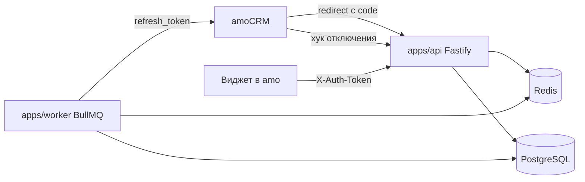

# Архитектура (фаза 0)

## Авторизация в amoCRM

Только OAuth 2.0: легаси-авторизация `auth.php` / USER_HASH не используется.

1. amo вызывает `GET /oauth/amo/callback?code&referer&state|from_widget`.
2. `referer` проверяется по белому списку доменов (`*.amocrm.ru`, `*.amocrm.com`, `*.kommo.com`),
   иначе `client_secret` можно было бы отправить на чужой хост.
3. Код обменивается на пару токенов (`POST https://{referer}/oauth2/access_token`), затем
   `GET /api/v4/account` даёт `account_id`. Аккаунт и токены сохраняются.
4. Токены хранятся зашифрованными (AES-256-GCM, ключ `TOKEN_ENCRYPTION_KEY`).

### Обновление токенов

Refresh-токен amo одноразовый: два параллельных обновления = потерянная авторизация.
`TokenService` обновляет пару под блокировкой строки (`SELECT … FOR UPDATE`),
поэтому одновременные запросы из API и воркера обновляют токен ровно один раз (это покрыто тестом).
Воркер каждые 30 минут обновляет токены, которым до истечения осталось меньше `TOKEN_REFRESH_MARGIN_SEC`
(по умолчанию 6 ч). Если refresh не прошёл, ошибка записывается в `amo_tokens.last_error`
и уходит алерт в Telegram. Статус виден в настройках виджета.

## Запросы виджета

Виджет вызывает `this.$authorizedAjax(...)`, amo добавляет заголовок `X-Auth-Token`:
JWT HS256, подписанный `client_secret`, с `aud` = `scheme://host` redirect URI.
Бэкенд проверяет подпись, `aud`, срок действия и `client_uuid`, а `account_id` берёт только из токена.
Поэтому данные одного аккаунта недоступны другому. CORS открыт только для доменов amo.

## Мультиаккаунтность

Все таблицы привязаны к `account_id`, репозитории всегда принимают `accountId`.
Row-level security в PostgreSQL — фаза 4.
